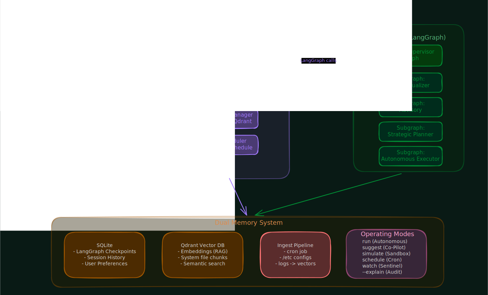
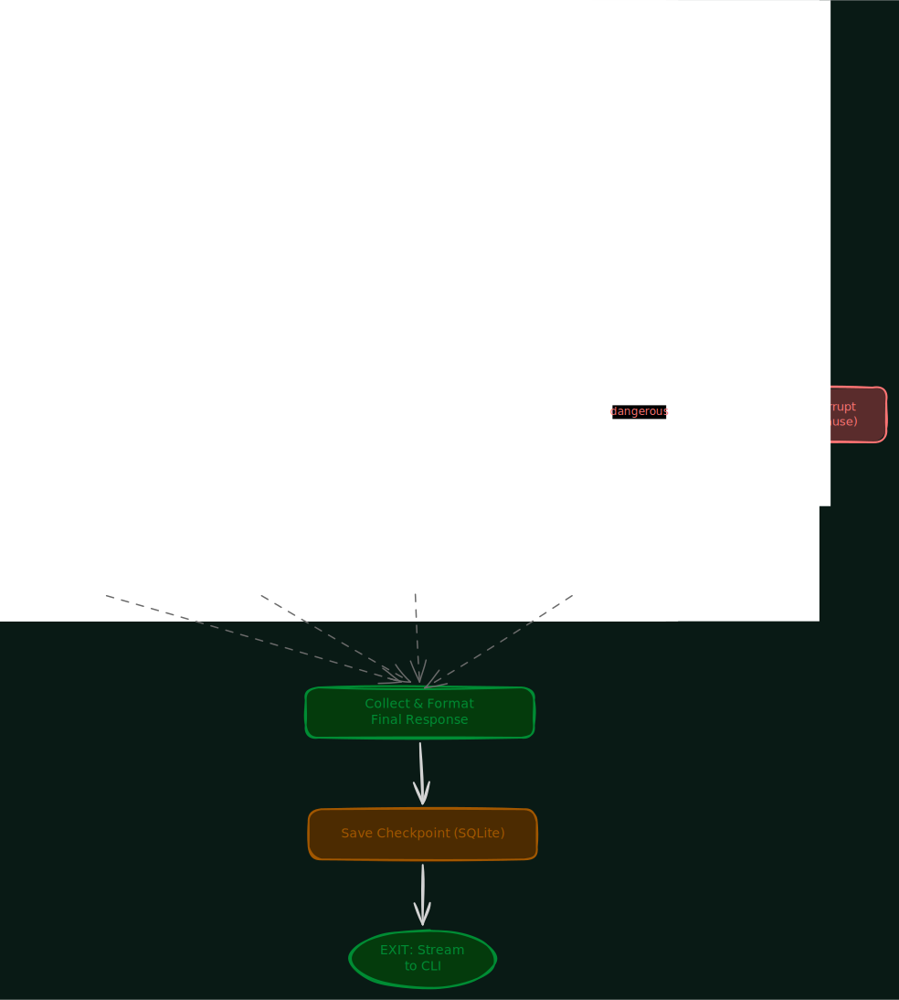
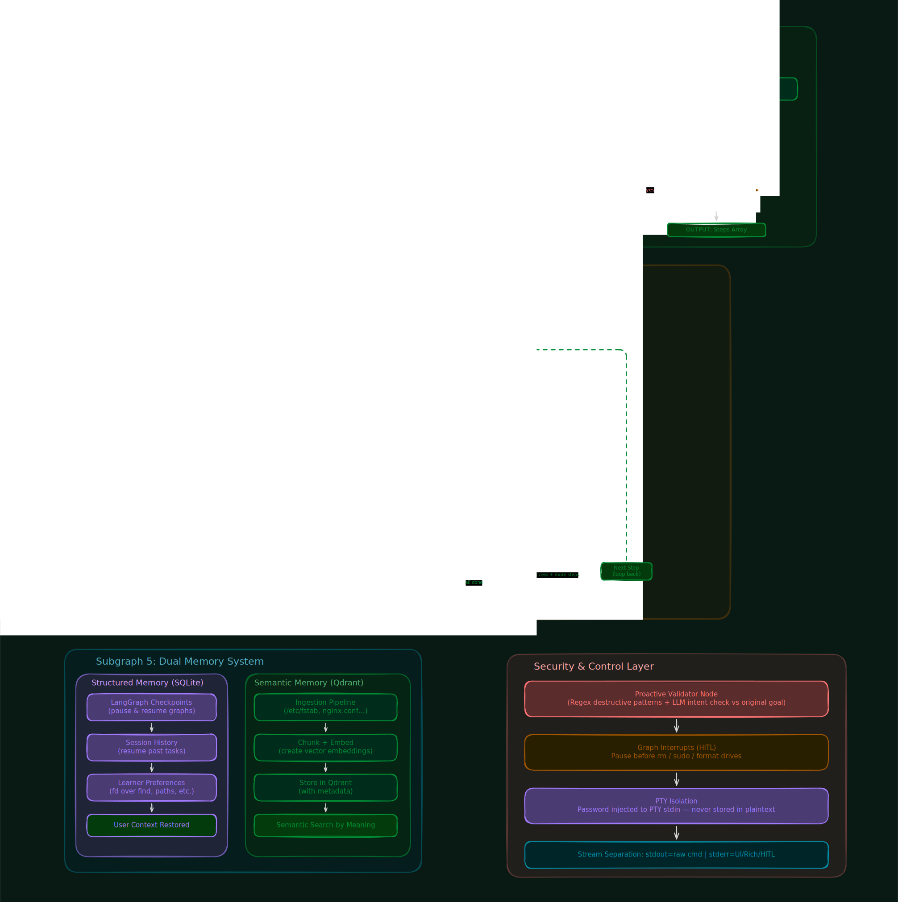

<h1 align="center">SuDoer</h1>

<p align="center">
  <strong>The autonomous system-aware agent for Linux infrastructure management.</strong>
</p>

<p align="center">
  
  
  
</p>

<br>

**SuDoer** is a persistent background daemon that lives on your Linux machine, understands the environment it runs in, remembers your preferences, diagnoses complex system failures, and automates intricate multi-step workflows safely and independently. It maintains a continuous shell session (a persistent pseudo-terminal) so that environment variables, sudo authentication tickets, and shell state survive across commands. A lightweight CLI communicates with the daemon over bidirectional WebSockets, keeping the interface stateless while the backend holds all the intelligence, state, and execution context.

<br>

## Table of Contents

- [Architecture](#architecture)
- [Operating Modes](#operating-modes)
  - [Autonomous Execution](#autonomous-execution)
  - [Co-Pilot / Suggest](#co-pilot--suggest)
  - [Simulate](#simulate)
  - [Schedule](#schedule)
  - [Watch / Sentinel](#watch--sentinel)
  - [Explain](#explain)
- [Key Capabilities](#key-capabilities)
  - [Context-Awareness](#context-awareness)
  - [Persistent PTY](#persistent-pty)
  - [Hierarchical Multi-Agent Orchestration](#hierarchical-multi-agent-orchestration)
  - [Dual Memory](#dual-memory)
  - [Multi-Layered Security](#multi-layered-security)
  - [Proactive Intervention](#proactive-intervention)
  - [Observability](#observability)
  - [Unix Philosophy](#unix-philosophy)
- [Technology Stack](#technology-stack)

---

## Architecture

SuDoer follows a strict client-daemon architecture. The CLI is intentionally thin -- it parses arguments, renders output, and handles keyboard input. All intelligence, state, and execution happen inside the daemon.

When you give SuDoer a task, it does not fire a single LLM call and hope for the right command. Instead, it runs a hierarchical multi-agent pipeline built on LangGraph. Specialized sub-agents decompose the goal into structured steps, validate every generated command against destructive patterns and the original user intent, probe your system for live context, execute with automatic error recovery (up to 3 retries), and pause for your explicit approval when an operation is flagged as sensitive.

The orchestrator is a master supervisor graph that routes intent to isolated subgraphs. Each subgraph is a self-contained state machine with a single responsibility:

- **Contextualizer** -- probes the system and queries semantic memory to build a context payload before any planning begins.
- **Strategic Planner** -- decomposes the goal into a sequential step array, with an internal feasibility critic loop that rejects impossible or unsafe plans.
- **Autonomous Executor** -- iterates through the plan, formats commands, runs them through the security validator, handles human-in-the-loop interrupts for sudo or destructive operations, and observes exit codes to trigger automatic fixes.
- **Advisory Analysis** -- a read-only diagnostic mode that deeply reads system logs, applies LLM-based reasoning, and generates human-readable reports without executing anything.

<p align="center">
  
</p>

<p align="center">
  
</p>

<p align="center">
  <em>The master supervisor graph routes intent to the appropriate subgraph based on the user's request type and execution mode.</em>
</p>

<p align="center">
  
</p>

<p align="center">
  <em>Each subgraph is an isolated LangGraph state machine -- Contextualizer gathers system state, the Planner decomposes goals with a feasibility critic, and the Executor runs commands through a security-validated loop with error recovery.</em>
</p>

---

## Operating Modes

SuDoer is controlled through distinct modes, each designed for a different workflow.

### Autonomous Execution

```bash
sudoer run "update system and clean old kernels"
```

Plans the entire workflow, executes each step sequentially through the full agent pipeline (context gathering, strategic planning, security validation, execution, and observation), handles errors with automatic retries, and only pauses when an operation requires explicit human approval.

### Co-Pilot / Suggest

```bash
sudoer suggest "find large json files and extract top-level keys"
```

Analyzes your system context internally using safe helper commands, generates the appropriate commands, and writes the result to stdout in raw form. Designed for piping into other tools:

```bash
sudoer suggest "setup ufw firewall rules" | sudo bash
```

All UI rendering goes to stderr. Only executable payload reaches stdout, so the pipe receives exactly what it should execute.

### Simulate

```bash
sudoer simulate "change machine IP to static 192.168.1.50"
```

Executes the plan inside an isolated Docker container and reports the result without touching the host. Use it to preview the impact of system-level changes before committing them.

### Schedule

```bash
sudoer schedule --every "1d" --task "check disk usage and alert if above 90%"
```

Registers a recurring autonomous task. The daemon runs it on schedule through the same agent pipeline, with full context-awareness and error handling.

### Watch / Sentinel

```bash
sudoer watch --path "/var/log/syslog" --trigger "OOM"
```

Monitors system files and logs in real time. When a trigger condition is detected, it autonomously spawns an analysis subgraph to diagnose the situation and report back.

### Explain

```bash
sudoer run "diagnose why DNS is slow" --explain
```

Appended to any mode. Streams the agent's internal reasoning, node transitions, and decision-making steps to stderr in real time so you can audit exactly how the agent arrived at its actions.

---

## Key Capabilities

### Context-Awareness

Before suggesting or executing anything, SuDoer dynamically probes the host machine. It detects which package manager is available (apt, pacman, dnf), which tools are installed, the hardware configuration, disk usage, and the current system state. This means it generates commands that actually work on your specific machine, not generic answers that assume a default environment. The contextualizer subgraph runs non-destructive system probes and queries the vector database for relevant configuration files before any planning begins.

### Persistent PTY

A single continuous shell session that outlives any individual command. Environment variables, directory state, and sudo authentication tickets persist across the entire session. You authenticate once, and the daemon reuses the OS-level sudo ticket for subsequent privileged operations without prompting you again. This is a fundamental design choice -- instead of spawning a new process for every command, SuDoer maintains a real, long-lived pseudo-terminal with a full bash shell running inside it.

### Hierarchical Multi-Agent Orchestration

Complex tasks are not handled by a single monolithic prompt. A supervisor agent routes intent to specialized sub-agents through a structured LangGraph state machine. The planner decomposes goals into executable step arrays, a feasibility critic rejects impossible plans and forces a replan loop, a validator inspects every command against both regex patterns and LLM-based intent analysis before execution, and an observer monitors results and triggers error recovery. Each subgraph is an isolated, testable unit.

### Dual Memory

SuDoer learns and remembers through two complementary systems. Structured relational storage (SQLite) holds session history, user preferences, and LangGraph checkpoints so long-running tasks can survive daemon restarts and resume exactly where they left off. Semantic vector storage (Qdrant) indexes your system configuration files and logs through a background ingestion pipeline, enabling the agent to retrieve relevant context by meaning rather than exact string match. For example, asking "why is my display tearing" will retrieve X11 and Wayland configuration chunks from the vector store without needing to know the exact file paths.

### Multi-Layered Security

Every command passes through a strict validation pipeline before reaching the shell. A regex layer blocks known destructive patterns (rm -rf, dd, mkfs). An LLM layer compares the generated command against the original user intent to catch out-of-scope actions that the regex might miss. For anything flagged as destructive, requiring elevated privileges, or falling outside the stated goal, the agent pauses execution and asks for explicit human approval through a reactive human-in-the-loop interrupt. The sudo password is never stored in plain text or variables -- it is injected directly into the PTY's stdin stream and cleared from memory immediately.

### Proactive Intervention

You do not have to wait for the agent to ask you a question. At any point during execution, you can press Ctrl+I to pause the agent mid-thought, inject a steering message such as "skip step 3" or "use fd instead of find", and let it continue from the exact same point with modified intelligence. This works through bidirectional WebSocket messages that update the graph state and trigger an interrupt, allowing real-time human-AI collaboration on long-running tasks.

### Observability

Every LLM invocation is tracked in a dedicated database table: which model was called, how many input and output tokens were consumed, how long it took, and the estimated cost in USD. Structured logs flow through Loguru in JSON format with session IDs and node names. Distributed traces using OpenTelemetry span every LangGraph node, so you can pinpoint latency bottlenecks and cost spikes to the exact node in the pipeline.

### Unix Philosophy

stdout carries raw data. stderr carries everything else -- Rich-formatted output, progress indicators, reasoning traces, and approval prompts. This means `sudoer suggest "..." | sudo bash` works exactly as you expect, and piping, redirection, and composition with other CLI tools behave naturally without any special handling.

---

## Technology Stack

| Layer | Technology |
|---|---|
| CLI Framework | Typer, Rich |
| Daemon Framework | FastAPI, Uvicorn |
| Transport Protocol | WebSockets (bidirectional) |
| PTY Management | Python `pty`, `select`, `os` |
| Agent Orchestration | LangGraph, LangChain |
| LLM Providers | OpenAI, Anthropic, Ollama, Gemini, Groq |
| Vector Memory | Qdrant |
| Relational Storage | SQLite |
| Observability | OpenTelemetry, Loguru |
| Configuration | pydantic-settings, PyYAML |
| Package Manager | uv |

---

## License

This project is not yet licensed. A license will be added before the first stable release.
